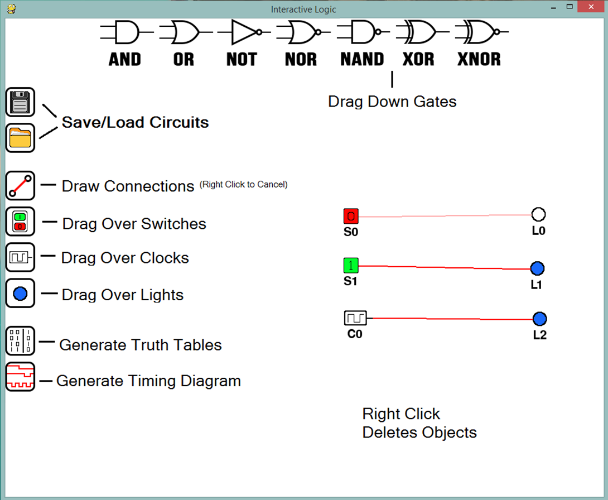

#Interactive Logic

##### Ver: Alpha 1.1
##### Created by Flanders Lorton

###Interactive Logic is a python app intended to create logic circuits
###The app should be intuitive and simple to use for new and experienced users

##Installing and running
Currently there is no built version of the application. Once the Beta version is complete there will be a build for PC,Mac&Linux

###Windows 64 Bit executable now added for version Alpha 1.1!
#####Just download and run!

###Steps for installation from source code:
1. Install Python 2.7 https://www.python.org/downloads/release/python-2713/
2. Install Pygame http://www.pygame.org/download.shtml
3. Download InteractiveLogicAlpha1_0.zip
4. Unzip and run InteractiveLogic/InteractiveLogic.py

>python InteractiveLogic.py

###Buttons / Layout
######Line tool is active when cursor is a diamond. Right click on white space to cancel.  

##Known bugs
- Dragging either window will disrupt clock output on timing diagrams
- Pausing timing diagram will not stop clock cycling
- Some large component loops may be evaluated incorrectly (Speculation)

Please send me a message if you find additional bugs

##Features To Be Added
- Clear button and timescale on timing diagram
- Scroll bar for large truth tables
- Export as Image
- Custom Re-Usable Components
