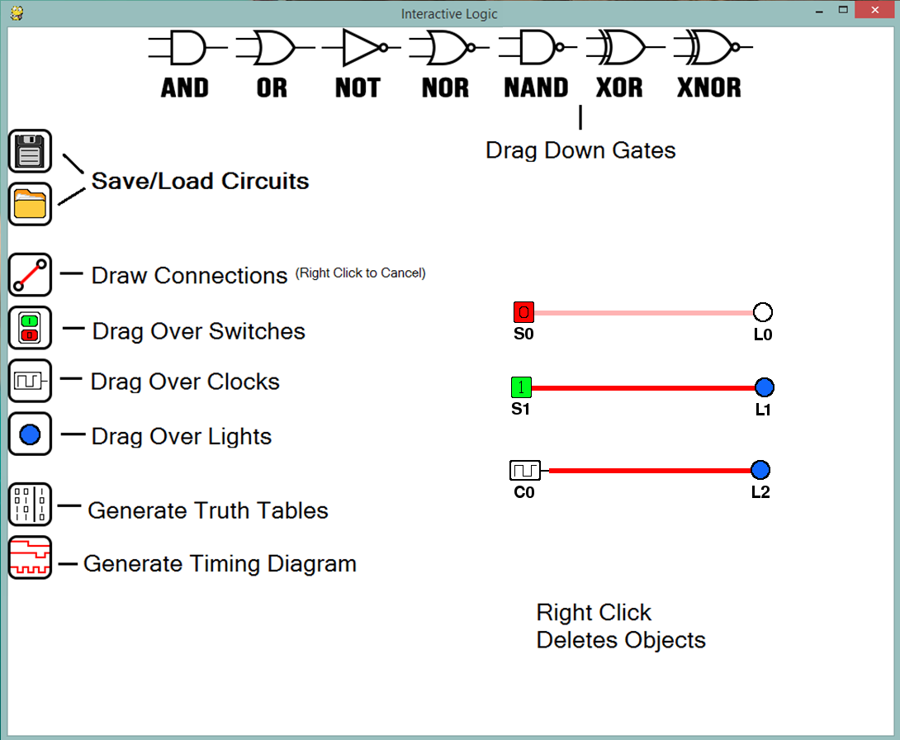
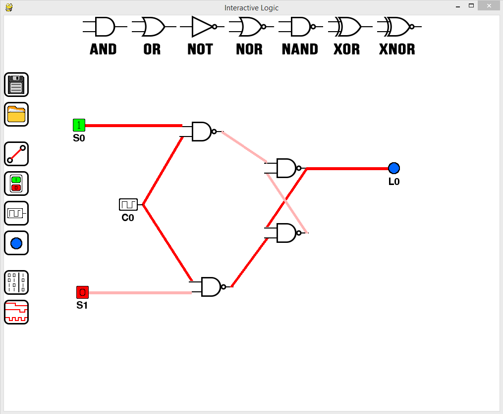

#Interactive Logic

##### Ver: Alpha 1.0
##### Created by Flanders Lorton

###Interactive Logic is a python app intended to create logic circuits
###The app should be intuitive and simple to use for new and experienced users

##Installing and running
Currently there is no built version of the application. Once the Beta version is complete there will be build for PC,Mac&Linux

###Steps for installation:
1. Install Python 2.7
2. Install Pygame http://www.pygame.org/download.shtml
3. Download InteractiveLogicAlpha1_0.zip
4. Unzip and run InteractiveLogic/InteractiveLogic.py

>python InteractiveLogic.py

###Buttons / Layout

###JK Flip Flop

###Full Adder

##Features To Be Added
- Truth Table Generator
- Timeing Diagram Generator
- Save/Load Circuit
- Export as Image
- Custom Re-Usable Components
