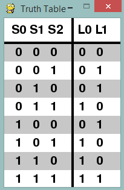
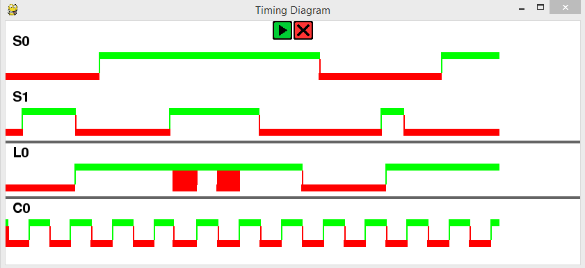

# Interactive Logic

##### Ver: Beta 1.1
##### Created by Flanders Lorton

### Interactive Logic is a python app for creating and modeling simple logic circuits
### The app should be intuitive and simple to use for new and experienced users

## Installing and running
Currently there are no builds for OSX, Win32, or Linux.

### Windows 64 Bit executable now added for version Beta 1.1!

##### Download `InteractiveLogicBeta1_1Winx64exe.zip`, extract, and run!

### Steps for installation from source code:
1. Install Python 2.7 https://www.python.org/downloads/release/python-2713/
2. Install Pygame http://www.pygame.org/download.shtml
3. Download InteractiveLogicBeta1_1SourceCode.zip
4. Unzip and run `python InteractiveLogic.py`

### Buttons / Layout

###### Line tool is active when cursor is a diamond. Right click on white space to cancel.  

### Full Adder

#### Adder Truth Table

### J K Flip Flop

#### Flip Flop Timing Diagram

## Known Issues
- Dragging either window will disrupt clock output on timing diagrams
- Pausing timing diagram will not stop clock cycling
- Program resolution is not designed for monitors smaller than 1920x1080 

Please send me a message if you find additional bugs :)

`florton@lion.lmu.edu`
